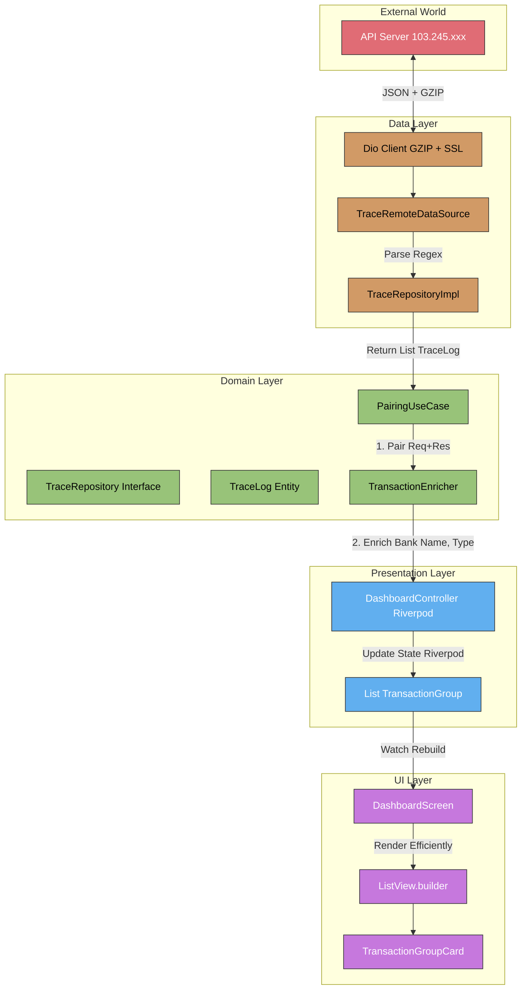

# System Architecture & API Resolution

## Goal Description
Documenting the finalized API Endpoints and Clean Architecture Data Flow for **Overwatch Mobile**.
This document serves as the Source of Truth for all network interactions and internal state management.

## User Review Required
> [!NOTE]
> These endpoints are implemented in `TraceRemoteDataSource` and are critical for the "Realtime Monitoring" feature.

## Resolved Structure

### [API Layer]
The "Three Musketeers" of data ingestion.

#### [POST] `/api/sdk/trace/list`
Fetch list of available log files.
- **Payload**: `{ "appName": "API EDC Nobu", "nodeName": "EDC Nobu" }`
- **Response**: List of filenames.

#### [POST] `/api/sdk/trace/view`
Fetch historical log content.
- **Payload**: `{ "appName": "API Nobu", "fileName": "trace_20230101.log", "lastPosition": 0 }`
- **Response**: GZIP Base64 `logCompressed`, new `lastPosition`.

#### [POST] `/api/sdk/trace/current`
Stream realtime log updates.
- **Payload**: `{ "appName": "API EDC Nobu", "nodeName": "EDC Nobu", "lastPosition": 1024 }`
- **Response**: GZIP Base64 `logCompressed` (delta only).

### [Architecture Layer]
Data flow from Server to UI, ensuring 60fps performance.

## Verification Plan
### Automated Tests
- `TraceRemoteDataSourceTest`: Verifies that API calls return correct Tuple structures.
- `IsoParserTest`: Validates Regex parsing for ISO 8583.

### Manual Verification
- **Realtime Monitor**: Open Dashboard -> Check if logs appear in real-time.
- **History View**: Click "History" -> Select Date -> Verify older logs load.
